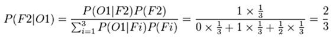

# The Monty Hall problem

The _Monty Hall problem_, or paradox, is a mathematical puzzle, based on the American game show 
'_Let's Make a Deal_'. It is named after _Monty Hall_, who hosted the game in the 
United States for thirteen years. More on [wikipedia...](https://en.wikipedia.org/wiki/Monty_Hall_problem)

> Note: Many presentations of this game talk about a car and two goats, but the goats are useless.
The goal is just to find behind which of the three doors the car is hidden, and leave with the car...


The strategy that the player has to adopt to maximise his chances of finding the car is surprising,<br/>
and many people are not convinced by the 
[Bayles'theorem](https://en.wikipedia.org/wiki/Bayes%27_theorem) ...



... and they only accept this result (2/3) when they see the result of a simulation.

# So, here the simulations !

Two very simple Perl scripts are provided in this repository.

### Simulation with 3 doors

```
> perl Monthy-Hall_Simulation_3_doors.pl

MONTY HALL simulation

% of wins depending on the strategy used by the player.
(Result after 100000 simulations)

          By keeping his choice: 33.42%
         By changing his choice: 66.58%
By changing randomly his choice: 50.01%
```
So, yes, **changing** his/her choice is the best strategy to find the car (2/3 = 66% of success)

### Simulation with _n_ doors

```
>perl Monthy-Hall_Simulation_n_doors.pl

MONTY HALL simulation with n doors

% of wins depending on the strategy used by the player and the number of doors.
(Result after 100000 simulations for each number of doors)

+-doors-+--1st--+--Chg--+--Rnd--+
|    3  | 33.41 | 66.59 | 49.78 |
|    4  | 24.80 | 37.52 | 33.38 |
|    5  | 20.15 | 26.32 | 25.03 |
|    6  | 16.90 | 20.80 | 19.96 |
|    7  | 14.38 | 17.12 | 16.69 |
|    8  | 12.52 | 14.49 | 14.06 |
|    9  | 11.04 | 12.79 | 12.66 |
|   10  | 10.06 | 11.35 | 11.08 |
|   11  |  8.78 | 10.10 |  9.96 |
|   12  |  8.24 |  9.38 |  9.03 |
|   13  |  7.73 |  8.39 |  8.19 |
|   14  |  7.21 |  7.84 |  7.78 |
|   15  |  6.66 |  7.21 |  7.13 |
|   16  |  6.35 |  6.69 |  6.55 |
|   17  |  5.79 |  6.29 |  6.27 |
|   18  |  5.52 |  5.75 |  5.73 |
|   19  |  5.17 |  5.63 |  5.49 |
|   20  |  5.00 |  5.38 |  5.27 |
```

Notes: These figures are the result of simulations using pseudo-random numbers,
the values vary slightly from one run to the next.

# As a developer, you have an advantage!

If you are a developper you don't need the Bayes'theorem.

```
if( firstChoice == carDoor ){
    A++;    # Strategy #1: The player keeps his first choice
}else{
    B++;    # Strategy #2: The player changes his mind and chooses the other door
}
```

If you agree that the probability of having  ```firstChoice == carDoor``` is 1/3<br/>
then you agree that the else branch is executed with a probability of 2/3.<br/>
So after 100 executions A is ~33, B is ~66.

It's that easy !
